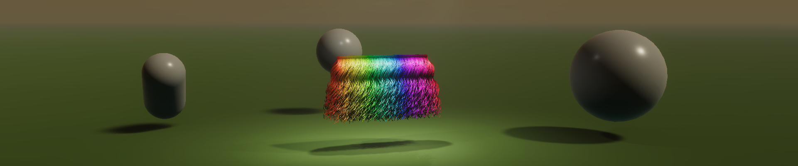

# Package: com.unity.demoteam.hair



<div align="justify">An integrated solution for authoring / importing / simulating / rendering strand-based hair in Unity. Built from the ground up with Unity users in mind, and evolved and hardened during the production of 'Enemies', the hair system is applicable not only to realistic digital humans, but also to more stylized content and games. It allows users to easily create 'Hair Assets', either from grooms from external DCC tools (through the alembic file format for curve data), or through simple built-in procedural generation tools (e.g. scatter x amount of hairs on a mesh or other primitive, or using a custom generator). Using a fast and flexible GPU-based solver that works on both strand- and volume-information, the system enables users to interactively set up ‘Hair Instances’ within scenes, and then see and interact with those instances as they are simulated and rendered in real time.</div>


## Requirements

- Unity 2020.2.0f1 +
- Compute shader enabled platform


## Features

* Authoring
	+ Import grooms from external DCC tools through the alembic file format (.abc)
	[ *depends on **com.unity.formats.alembic >= 2.2.2*** ]
	+ Make procedural grooms in just a few clicks
		- Scatter strands on built-in primitives, or on user specified meshes
		- Shape strands using simple parameters like length and curl
		- Plug in your own generators for custom placement
	+ Hierarchical clustering / Level of detail
		- Build clusters and LOD chain automatically from spatial relationships
		- Can also assign artist-provided clump maps + optionally refine them
		- Supports root-, strand-, and simplified strand-level clusters
	+ Need to inject curves from a different system?
		- Plug in your own providers for custom curve data
		- Custom data also benefits from built-in processing pipeline
		
* Skinning
	+ Easily attach strand roots to skinned geometry in a scene
	[ *depends on **com.unity.demoteam.digital-human >= 0.1.1-preview*** ]

* Simulation
	+ Strand-based solver supporting tens of thousands of individual strands
	+ Solver also adds volume-based quantities such as density and pressure
		- Uses physical strand diameter, physical strand margin
		- Applies pressure to preserve the volume of a groom
			- Allows targeting uniform density
			- Allows targeting initial pose density
		- Applies pressure to soften strand-strand collisions
		- Exposes scattering probe to HDRP physical shading model
	+ Fully configurable set of constraints
		- Boundary collision w/ friction
		- Particle-particle distance (soft, hard)
		- Particle-root distance
		- Local bend limiter (<, >, =)
		- Local shape
		- Global position
		- Global rotation
	+ Level of detail support

* Rendering
	+ Supports all current rendering pipelines
		- Built-in RP
		- HDRP
		- URP
	+ Easily build your own hair materials
		- Add the ‘HairVertex’ node to any Shader Graph to read the simulation data
		- Add the 'HairVolume' node to access simulation volume data like density
		- (**Planned**) Optionally, assign generic materials as the cost of serializing strands to generic mesh
		[ *will depend on **Unity >= 2021.2** for vertex buffer access* ]
	+ Multiple modes of rendering
		- Render strands as simple line primitives
		- Render strands as view facing triangle strips w/ tangent space normals
		- Render strands as (view facing, for now) tube geometry w/ object space normals
		- Render high quality strands using the upcoming compute-based HDRP line renderer
		[ *depends on **Unity >= 2023.1.0a21*** ]
	+ Level of detail support

* Level of detail
	+ Seamless level of detail for both simulation and rendering
	+ Automatic level of detail selection based on viewport coverage
		- Reduce runtime workload by processing only visible set of strands
		- Preserve global coverage as strands individually transition to subpixel
		- LOD scale/bias supported both per-group and per-material
	+ Volume-accurate reduction enabled by hierarchical clustering
		- Reduced set of strands geometry retains volume of full geometry
		- Volume-based effects remain intact for reduced set of strands

## Installation

Use [*Add package from git URL*](https://docs.unity3d.com/Manual/upm-ui-giturl.html) (in the Package Manager): 

```https://github.com/Unity-Technologies/com.unity.demoteam.hair.git```

... or declare the package as a git dependency in `Packages/manifest.json`:

```
"dependencies": {
    "com.unity.demoteam.hair": "https://github.com/Unity-Technologies/com.unity.demoteam.hair.git",
    ...
}
```


## Related links

- Video: [Enemies – real-time cinematic teaser](https://www.youtube.com/watch?v=eXYUNrgqWUU)
- Video: [Lion: A glimpse of the future with Unity Art Tools](https://www.youtube.com/watch?v=KpPx_lvthBQ)


## References

- [Bender et al. 2015] Position-Based Simulation Methods in Computer Graphics
- [Bridson and Müller-Fischer 2007] Fluid Simulation SIGGRAPH 2007 Course Notes
- [Gibou et al. 2002] A Second Order Accurate Symmetric Discretization of the Poisson Equation on Irregular Domains	
- [Harris 2004] Fast Fluid Dynamics Simulation on the GPU
- [Kelager et al. 2010] A Triangle Bending Constraint Model for Position-Based Dynamics
- [Kim et al. 2012] Long Range Attachments - A Method to Simulate Inextensible Clothing in Computer Games
- [Kugelstadt and Schömer 2016] Position and Orientation Based Cosserat Rods
- [Losasso et al. 2008] Two-Way Coupled SPH and Particle Level Set Fluid Simulation
- [Macklin et al. 2014] Unified particle physics for real-time application
- [Macklin et al. 2019] Small Steps in Physics Simulation
- [McAdams et al. 2009] Detail Preserving Continuum Simulation of Straight Hair
- [Müller et al. 2006] Position Based Dynamics
- [Müller et al. 2012] Fast Simulation of Inextensible Hair and Fur
- [Petrovic et al. 2005] Volumetric Methods for Simulation and Rendering of Hair
- [Zhu and Bridson 2005] Animating Sand as a Fluid


## See also

https://github.com/Unity-Technologies/com.unity.demoteam.digital-human
